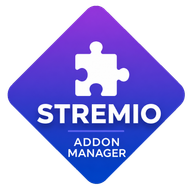

<div align="center">



# 🎬 Stremio Addon Manager

**The ultimate tool to manage, organize, and sync your Stremio addons.**

[]()
[]()
[]()

</div>

---

## ✨ Features

- 🔐 **Login & Multi-Account** — Sign in with your Stremio account and switch between saved accounts instantly
- 📦 **Addon Management** — Browse, search, select, and reorder your addons with drag & drop
- ⭐ **Favorites** — Star your most-used addons for quick access, import/export favorites as JSON
- 🔗 **Add by URL** — Install any addon by pasting its manifest URL
- 🔄 **Sync to Stremio** — Push your curated addon list directly to your Stremio account
- 📱 **PWA Support** — Install as a native-like app on desktop and mobile
- 🌙 **Dark Theme** — Beautiful dark UI inspired by Stremio's design language
- 📲 **Mobile Friendly** — Fully responsive, works great on phones and tablets

## 🚀 Getting Started

### Prerequisites

- [Node.js](https://nodejs.org/) 18+
- A [Stremio](https://www.stremio.com/) account

### Install

```bash
git clone https://github.com/your-username/stremio-addon-manager.git
cd stremio-addon-manager
npm install
```

### Development

```bash
npm run dev
```

### Build

```bash
npm run build
```

### Preview Production Build

```bash
npm run preview
```

## 🌐 Deploy to GitHub Pages

The project includes a GitHub Actions workflow that automatically deploys to GitHub Pages on push to `main`.

1. Go to **Settings → Pages**
2. Set **Source** to **GitHub Actions**
3. Push to `main` — your app is live! 🎉

## 🛠️ Tech Stack

| Technology | Purpose |
|---|---|
| ⚛️ React 19 | UI framework |
| ⚡ Vite 8 | Build tool & dev server |
| 🎯 @dnd-kit | Drag & drop reordering |
| 💻 vite-plugin-pwa | Progressive Web App |
| 🎨 Custom CSS | Stremio-inspired design system |

## 📂 Project Structure

```
src/
├── components/          # UI components
│   ├── Header.jsx       # App header with user info
│   ├── LoginForm.jsx    # Login / Register form
│   ├── SavedAccounts.jsx # Quick account switcher
│   ├── AddonList.jsx    # Sortable addon list
│   ├── AddonCard.jsx    # Individual addon card
│   ├── AddonToolbar.jsx # Search, sync & actions
│   ├── AddAddonModal.jsx # Add by URL or favorites
│   ├── FavManagerModal.jsx # Manage favorites
│   ├── SyncDialog.jsx   # Sync confirmation
│   ├── Toast.jsx        # Toast notifications
│   └── Icons.jsx        # SVG icon components
├── hooks/
│   ├── useLocalStorage.js
│   └── useToast.js
├── utils/
│   └── addon.js         # Addon utility functions
├── stremioApi.js        # Stremio API client
├── App.jsx              # Main app shell
├── App.css              # All component styles
├── index.css            # Design tokens & globals
└── main.jsx             # Entry point
```

## 📄 License

MIT

---

<div align="center">

**Made with ❤️ for the Stremio community**

</div>
